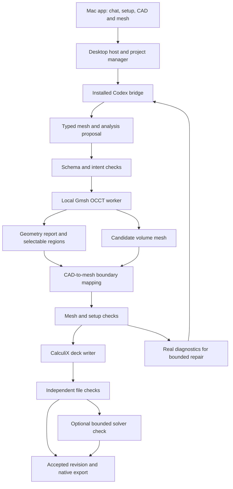

# STEP Mesh Studio: proposed design and delivery plan

Prepared 6 October 2026; decision updated 7 October 2026. **Planning only; Option 1 selected for the first release, Option 2 deferred. No application implementation yet.** User confirmed CalculiX first and Abaqus-compatible export later. Five alternatives are in [OPTIONS](../../OPTIONS.md). The current execution sequence is in [the selected delivery plan](2026-10-07-option-1-delivery-plan.md).

## 1. Product promise and initial boundary

A mechanical engineer opens a STEP file, describes the desired mesh and analysis setup in chat, inspects highlighted regions and the resulting mesh, asks for refinement, and exports the selected revision as an INP file.

Selected MVP: **Option 1, Mesh & Load Studio**. Retain Part Studio's reliable installed-agent, worker, checked-revision and export patterns. Selected UI: Guided Setup with a large central viewport, contextual settings and persistent Codex chat that can operate every supported preparation stage. Preserve the accepted artifact during failures; export exactly the displayed accepted revision. Subscription inference may use the provider's cloud. Do not introduce app-owned inference keys or an automatic provider switch.

Accept arbitrary STEP files into an inspection workflow. Version 1 meshes validated, closed, single-solid geometry that the chosen importer and mesher can handle within resource limits. Irregular/freeform solids can be attempted when inspection passes; supported success claims depend on evaluated examples, not only plates/templates. Reject/report open shells, nonmanifold geometry, intersecting bodies and unsupported conditions. Keep multi-body/contact, shells/midsurfaces, beams, guaranteed all-hex meshing, nonlinear/dynamic analyses and geometry edits out of the first release.

Two distinct exports:

- **Mesh INP:** nodes, structural elements and meaningful sets. Can be exported without materials or loads, explicitly identified as mesh-only.
- **Analysis INP:** mesh plus checked materials/sections, loads, supports, analysis step and requested outputs. Require a complete supported setup; report separately whether a real solver run passed.

## 2. Concrete user journey

Example: import an original cantilever STEP; the worker measures a 100 × 20 × 10 mm solid aligned along X.

User: “Use a 3 mm quadratic tetra mesh. Fix the end at minimum X. Apply 100 N in negative Z over the opposite end. Use E = 210000 MPa and Poisson ratio 0.3.”

1. Import report shows measured geometry, source units and normalized dimensions. Missing or contradictory units trigger clarification.
2. The AI produces a structured proposal using measured region IDs. The viewport highlights the two end regions and arrows/support symbols. Material and load values remain editable in a compact setup panel.
3. The worker creates the mesh and checks geometry conformity, elements and region mapping.
4. Follow-up: “Make it finer near the fixed end, but keep the rest around 3 mm.” The app shows the proposed local sizing field, builds a candidate and compares quality/counts/time with the accepted mesh.
5. Checks show mesh acceptance, setup completeness, and solver-run status separately. Export writes the selected accepted revision.

Do not claim the model will pass a stress limit because it was meshed. The illustrative 100 N is a user-supplied load, not inferred from shape.

## 3. The AI's role and bounded execution

The worker, not the language model, measures geometry. Give the agent a compact geometry report, available region descriptors, mesh statistics, setup state, last accepted settings and real diagnostics. Screenshots supplement the structured data.

Proposed tool contract:

| Operation | Input | Actual output |
|---|---|---|
| inspect_geometry | copied STEP + declared units | bodies, face/edge descriptors, bounds, volume, import issues |
| resolve_region | geometric selector or picked region | candidate IDs, measurements, ambiguity status |
| propose_setup | chat intent + current setup | schema-validated mesh/material/load/support changes |
| generate_mesh | geometry revision + mesh settings | candidate mesh and logs |
| evaluate_mesh | candidate + acceptance profile | named metrics, failures and resource use |
| map_regions | CAD regions + candidate mesh | node sets and volume-element/local-face pairs |
| write_inp | candidate + supported analysis schema | deterministic deck and provenance |
| validate_deck | exported file + expected setup | independently reparsed connectivity/sets/load totals |
| run_solver_check | complete deck + time/memory budget | CalculiX status, diagnostics and selected measurements |

Use a fixed meshing/tool library with schema-validated settings. Arbitrary agent-generated Python is unnecessary for the first release. Reject unknown tools, parameters, element families and inconsistent values. Worker processes run with limits; the agent cannot silently install packages, change the source geometry, invent materials, suppress failing checks or increase budgets.

Bounded recovery: initial attempt plus at most two repairs. Return the actual cause on failure; preserve the prior accepted mesh and setup. Explicit commands such as “fix this face” can apply without repeated approval prompts once the region is uniquely resolved. Ask a focused question when the task is ambiguous.

## 4. Architecture and reuse



Proposed shell: Electron with a narrow preload bridge and a separate Python worker. Reuse Part Studio's patterns for agent sign-in, project state, cancellation, progress, revisions and native dialogs after checking their actual dependencies. Keep this as a separate project; do not modify Part Studio while planning.

Gmsh/OCCT is the first geometry/mesh authority. Entity IDs from a separately imported build123d/FreeCAD model cannot be assumed equal. Use one authoritative import to generate geometry descriptors, surface previews and volume-mesh mappings. A separate kernel may serve fixture evaluation, with explicit geometric comparisons rather than shared IDs.

The current CAD viewer is not established as an editable FEM mesh viewer. Evaluate a small Three.js or vtk.js renderer during the spike. Required capabilities: triangle/entity picking, CAD/mesh toggles, surface wireframe, region highlighting, load vectors, axes, fit/reset and clipping or interior-cell inspection. Keep display simplification separate from the full export mesh. If the reused viewer cannot supply these, implement a dedicated viewport.

No database or extra remote CAD service is needed initially.

## 5. Import, units and repair

Copy and hash the original STEP. Preserve it unchanged. Record import settings and native-library versions, units read from metadata, any conversion and the normalized geometry hash. Target mm/N/MPa for the first structural case; retain seconds and derived mass conventions when adding inertial loads. Do not merely relabel metre coordinates as millimetres.

Report bodies, bounding dimensions, volume, surface area, face types and import warnings. Cylindrical faces are candidates, not automatically recognized bolt holes. Hole inference requires orientation/topology evidence.

Allow bounded import cleanup only when changes are recorded and within a tested tolerance. Compare pre/post dimensions and volume where meaningful. Geometry-changing defeaturing or removal of small holes requires an explicit user instruction. If cleanup changes topology, invalidate/re-resolve affected load/support regions. Never silently reuse stale face tags.

## 6. Region identity: essential to the product

Store regions in CAD terms, not only node IDs: geometry revision/hash, entity IDs for that import, face type, area, centroid, normal/axis and neighboring topology. Semantic labels such as `fixed_end` and `loaded_end` refer to this record.

Within an unchanged geometry revision, preserve authoritative entity associations. After reimport/repair, matching by geometric descriptors is a candidate resolver; symmetric or split/merged faces can be ambiguous. Show matches and require reselection if uniqueness cannot be established.

After each remesh:

1. Rebuild all region node sets and volume-element boundary-face pairs.
2. Include quadratic midside nodes where appropriate.
3. Validate selected surface area/location and boundary membership.
4. Validate element local-face numbering and normal/load sign.
5. Compare resultant forces and moments with the requested values.
6. Render the new mapping, then accept the candidate only if the required checks pass.

Raw surface triangle elements used for viewing or boundary classification must not accidentally become additional structural shell elements in a solid analysis.

## 7. Meshing and refinement policy

Start with tetrahedral volume meshes. Use a fast linear candidate for import/debugging if useful, and quadratic tetrahedra as the proposed structural export default. Backend-to-C3D10 node ordering, curved-edge placement and boundary-face numbering must pass explicit tests before use.

Compare candidate Gmsh algorithms during the spike; choose an evaluated default rather than assuming one algorithm wins for every geometry. Save every setting that influences the mesh.

Supported refinement controls: global target size, local size on selected regions, distance-based transitions, curvature-related sizing, and a declared growth/size budget. Propose refinement around relevant selected holes/fillets or supports, with visible settings. Avoid saying all support/force locations are automatically stress hotspots.

Geometry/quality repair uses reported diagnostics: adjust a size field, optimize supported element placement or try one approved alternate algorithm. Finer meshes can still contain poor elements. Do not silently relax acceptance thresholds to obtain a pass.

Quality report: counts by element family, size distribution, element Jacobian/shape metrics with exact definitions, worst elements and locations, conformity checks, disconnected/duplicate entities, meshing time and estimated resource use. A tetra aspect ratio and a normalized quality score are different measures; show definitions and evaluation profiles. Quadratic validity requires checks beyond corner-tetra volume, using supported sampled metrics and solver evidence; sampling is not a mathematical proof of global positivity.

Set numeric acceptance thresholds from the feasibility benchmarks and named metric definitions. Never advertise an uncalibrated universal “mesh quality 95%.” Show Passed, Needs attention or Failed with the actual criterion. Stop on budget, cancellation, invalid geometry or exhausted repairs.

## 8. Materials, loads, supports and deck writing

MVP analysis: one solid, one homogeneous isotropic linear-elastic material, small-displacement linear static response, global Cartesian axes, and a supported complete load case.

- Material: explicit E and Poisson ratio. Save units and user-supplied source; no guessed steel grade.
- Supports: fixed translations, specified displacement components, and axis-aligned symmetry using translational degrees of freedom. A solid node's support interface must not pretend it has beam rotational DOFs.
- Pressure: selected CAD surfaces, explicit magnitude and normal direction, mapped to volume-element faces.
- Distributed force: explicit total vector over a selected surface. Implement consistent nodal integration for the selected element order; preserve resultant and moment under refinement. Equal force per node is not the default for a quadratic mesh.
- Later: gravity requires density/unit handling; moments/reference-point couplings, bolt preload and contact need separate models/tests.

Preflight checks include nonempty sets, coherent units, valid references, conflicting prescribed displacements, missing material/section definitions and likely rigid-body modes. For supported simple models, evaluate constraint rank against the six rigid modes, then corroborate with actual solver diagnostics. Do not add supports merely to make a singular solve succeed.

Write the deck deterministically from the accepted schema. Validate `*NODE`, `*ELEMENT`, `*NSET`, `*ELSET`, material/section, boundary/load cards and step/output data against the pinned CalculiX contract. Comments and sidecar reports preserve provenance/units. Independently reparse the **saved file**, not just the in-memory object.

CalculiX support does not establish full Abaqus compatibility. Later export uses an explicit dialect adapter and real import/solve verification.

## 9. Solver-driven refinement: Option 2 extension

First establish a repeatable coarse/medium/fine study with fixed geometry, material and region definitions. Let the user select the response quantity: displacement at a region, strain energy, or a stress statistic away from known singularities. Define the tolerance, budget and stop rule before the run.

Compare at least three levels for a trend and report differences; a single pair within tolerance is not proof of convergence. Record solver diagnostics, reactions and load balance. A declining change is evidence for that measured quantity over those levels, not a universal accuracy guarantee.

Only then investigate local result-based adaptation using an explicit indicator. Treat stress spikes at ideal clamps, sharp corners and point loads as potential singularities; do not endlessly chase maximum stress with smaller elements. Keep mesh quality repair, a mesh-size study and error-driven adaptation as distinct operations.

The first app can perform optional bounded solver acceptance checks while postponing full result visualization/adaptation.

## 10. Project and UI contract

```text
example.meshstudio/
  project.json
  inputs/original.step
  geometry/import-report.json
  setup/analysis.json
  regions/regions.json
  revisions/r0001/
    settings.json
    mesh.msh
    mesh.inp
    analysis.inp
    region-map.json
    checks.json
    preview/
    logs/
    solver/                 # when actually run
  reports/
```

Manifest records geometry hashes, units, worker/solver versions, requested settings, mesh/setup revision, artifact hashes, parent/base revision, checks and run status. Analysis edits can invalidate only the relevant checks; any mesh change rebuilds node/face mappings and decks. Save atomically; candidate failures never overwrite accepted files.

One Mac window: Guided Setup rail on the left, a large central CAD/mesh viewport with contextual settings, persistent Codex chat on the right, and a collapsible checks/history tray. [UI concepts](../UI_CONCEPTS.md) records the selected direction. The agent can operate the entire supported flow; guide stages follow actual state rather than forcing manual Next actions. Show accepted versus pending revision and the export base. Progress: Importing → Inspecting → Planning → Surface meshing → Volume meshing → Checking → Writing deck → optional Solver check. Include elapsed time and Stop; use actual worker events rather than invented percentages.

Display **Mesh checked**, **Setup complete/incomplete**, and **Solver run passed/not run/failed** independently. A solver failure can coexist with an exportable checked mesh. Full-analysis exports must carry the true validation status.

## 11. Milestones and evidence gates

| Gate | Deliverable | Required evidence before moving on |
|---|---|---|
| A. Kernel/export feasibility | Small original beam and holed block STEP → quadratic tet → complete INP | Independent reparse; all pressure-face signs/order verified; actual CalculiX run on this Mac; analytic response and resultant/reaction checks. |
| B. Region and refinement feasibility | Picked/named faces survive local remeshing | Same intended geometry, regenerated IDs/sets, invariant load resultant/moment, clear ambiguity behavior. |
| C. AI workflow | Chat proposes settings/setup and responds to real failures | Real installed Codex run; clarification, bounded repair, budget/usage failure and cancellation preserve accepted state. |
| D. Mac workflow | Import, pick, mesh, refine, edit supports, export, save/reopen | Entire example from app window; actual exported deck inspected and solved; viewer and export revisions agree. |
| E. Pilot | Finder-launchable app with setup diagnostics | Native dialogs, subprocess cleanup, restart/reopen; another Mac's prerequisites and first-part workflow tested before making fresh-machine claims. |
| F. Optional extension | Solve/result study or second backend | Separate benchmarked integration; do not declare it done from backend documentation alone. |

Estimate dates only after Gate A reveals native runtime, region mapping and deck-writing costs. Avoid building the full UI before the import/remesh/export spike passes.

## 12. Verification matrix

Use original, non-confidential models. Keep fixture reference values separate from the analyzer.

| Case | What must be demonstrated |
|---|---|
| Axial bar with distributed end force | Load and reaction balance; displacement versus FL/EA away from end effects. |
| Slender cantilever | Deflection trend against beam theory with declared assumptions; preserve analysis conditions across refinements. |
| Block with pressure, each tetra face orientation | Correct face identification, normal/sign, force and moment; no inverted mappings. |
| Holed plate, spacer and bracket | Mesh conformity and useful local refinement on real imported geometry. |
| Curved/filleted solid | Quadratic placement and sampled validity checks; solver accepts exported mesh. |
| Rotated and equivalent metre/mm models | Explicit frame/unit conversion with matching physical response. |
| Tiny feature and thin wall | Budget-aware behavior; no silent feature removal or claims of universal suitability. |
| Open shell, invalid/nonmanifold and multi-body input | Clear supported/unsupported diagnosis; no false successful solid mesh. |
| Symmetric faces and repaired topology | Ambiguity surfaced; no silent load/support reassignment. |
| Missing material, conflicting supports, unrestrained body | Mesh-only status or explicit setup failure; no invented correction. |
| Remesh with distributed force | Total force and moment retained, including quadratic nodes. |
| Cancellation, worker crash, usage limit | Accepted geometry/mesh retained; cleanup and recovery verified. |
| Export corruption/reopen | Hash/file parsing catches changed artifacts; selected revision remains unambiguous. |

Benchmark logs should record first-pass success, repairs, element counts, metrics, elapsed time, actual solver status and failures. A successful process exit alone does not establish the geometry, loads or physical response were correct.

## 13. Release decisions and open choices

Confirmed: new project folder, AI chat, STEP input, mesh/refine/INP, loads/supports, CalculiX first and Abaqus later.

Selected product direction: separate Apple Silicon macOS app, installed Codex, mesh-quality refinement and CalculiX setup/export first; solver-driven refinement later. Proposed first-release limits remain one solid, quadratic tetrahedra and linear static setup, without geometry edits or contact. UI and detailed limits are documented for review in the selected delivery plan.

Dependencies such as Gmsh and CalculiX have distribution-license implications. Record the actual pinned component licenses and choose a compatible open-source/distribution route during the spike; do not assume Part Studio's MIT label transfers to this package. Native architecture, worker restrictions, source notices and signing/notarization are release gates.

No implementation, dependency installation or external publishing is authorized by this planning document itself. After option selection, turn Gate A into the first implementation task.
